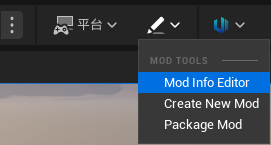
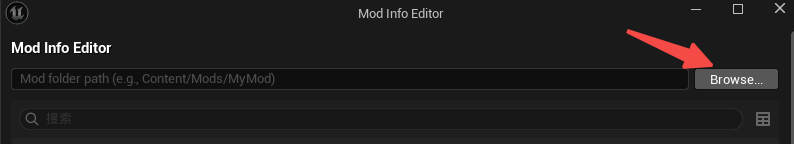
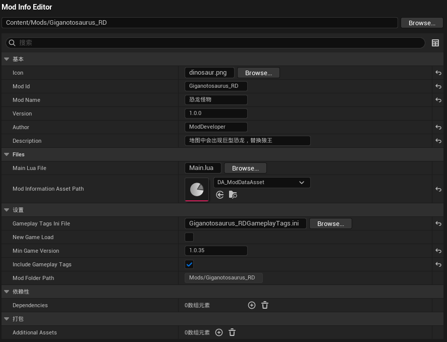
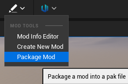
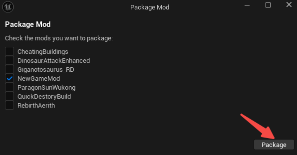
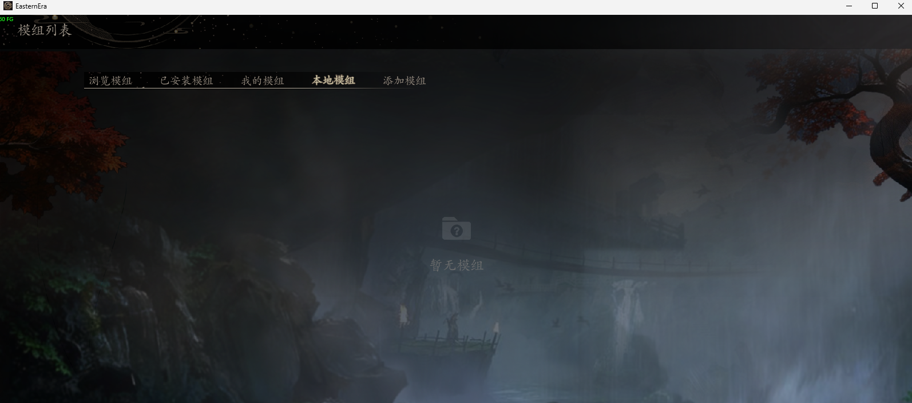

# Mod Packaging & Testing Quick Start

Matches **[ModTesting.md](./ModTesting.md)** and **[ModEditorAndPackaging.md](./ModEditorAndPackaging.md)**; if your shipped client paths differ, use whatever path actually loads Mods.

---

## Before packaging

Open **Mod Info Editor**, pick the **Mod folder** (must be `Content/Mods/<ModName>/`).

Verify Mod info, then save.

---

## Package

Open **Package Mod**, select Mod(s), click package (Cook runs first if assets require it).

**Output**: **`<ModProjectRoot>/Mods/<ModId>/`** with `<ModId>.pak`, `ModInfo.json`, main Lua, icon, etc. `ModId` from `ModInfo.json`; if unset, usually matches `Content/Mods` folder name. See [ModTesting.md §1](./ModTesting.md).

---

## After package — test

Copy the **`Mods/<ModId>/` folder** to:

**`<GameInstall>\EasternEra\EasternEra\Content\Mods\<ModId>\`**

Steam example: `<GameInstall>\Steam\steamapps\common\EasternEra\EasternEra\Content\Mods\<ModId>\`

**Note**: must be under **`Content\Mods`**, not `EasternEra\EasternEra\Mods` without `Content`. If **`Mods`** is missing, create it under **`...\EasternEra\EasternEra\Content\`**, then drop `<ModId>` inside.

Launch game → Workshop (or Mod UI) → Local Mods tab → enable Mod.

