# 角色配置

**骨骼与导入**：若配置的是 **人类主角可用的身体网格**，须绑定 **Mannequin 参考 `USkeleton`**，见 [模型导入与骨骼匹配说明.md](./模型导入与骨骼匹配说明.md)。

---

步骤1 | 打开DA_ModDataAsset

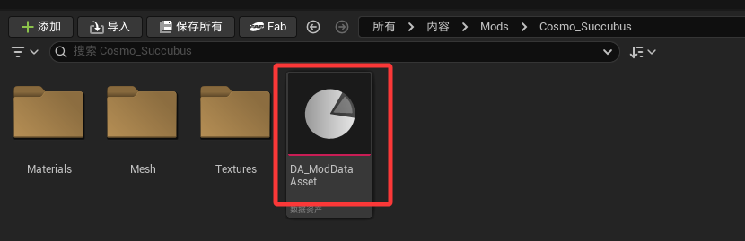

步骤2 | 关联配置表(共三张)

注意事项： | 1 | 三张配置表都需要放到xxx目录下，建议新建一个命名为"Config"的文件夹存放表格

2 | 注意配置表与Mod Config Type 类型必须匹配，具体看图示意

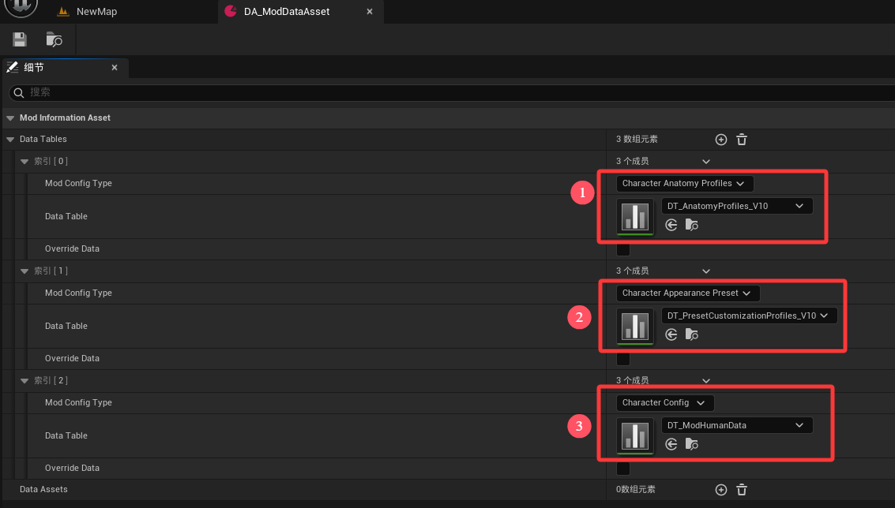

步骤3 | 配置表作用详解

1 | 模型外观配置：DT_AnatomyProfiles_V10

注意：行命名，此为后续调用的唯一ID

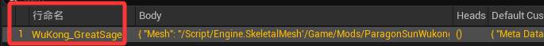

共有两种配置方式： | 1) | 头和身体是两个不同的模型(不建议) | 2) | 整体模型(建议)

~序号1配置身体模型，序号2配置头部模型 | ~直接在Body配置模型就可以了，其他什么都不用管

~序号所指位置，是他们各自的材质插槽命名和材质(可以不配置，不作为主角使用的话) | ~注意事项： | 1 | 左侧序号3所示位置勿动(配置角色需要)

2 | 当配置的是整体模型时，请勿勾选

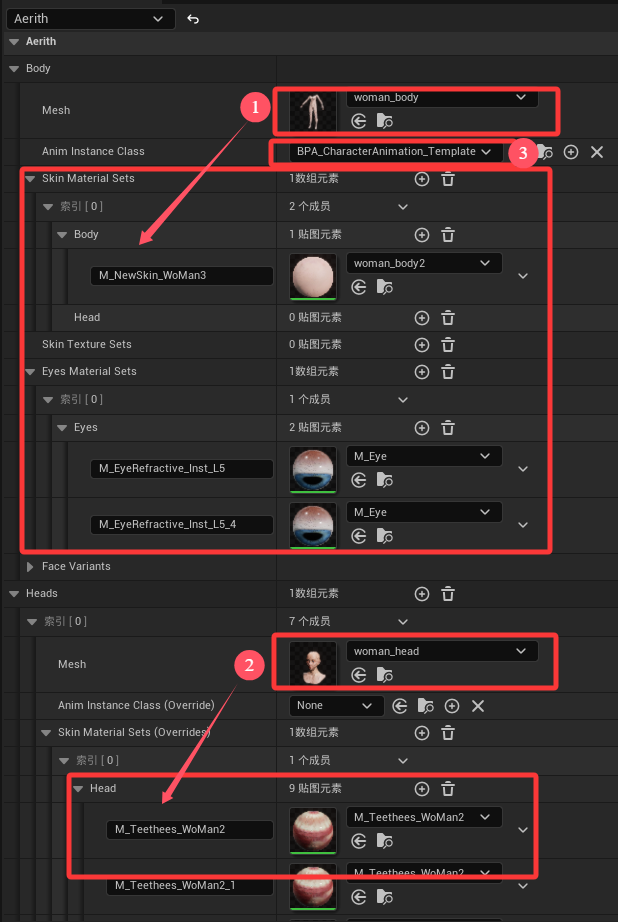

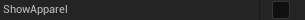

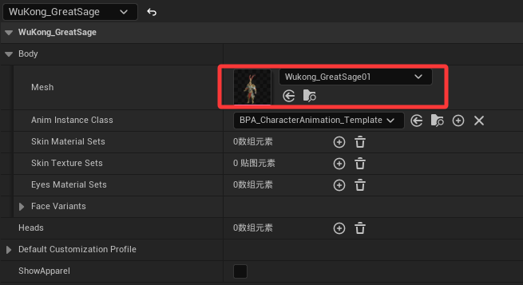

2 | 角色细节配置：DT_PresetCustomizationProfiles_V10

注意：行命名，此为后续调用的唯一ID(建议与Anatomy保持一致)

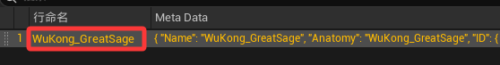

看图示意

1 | Name与行命名保持一致

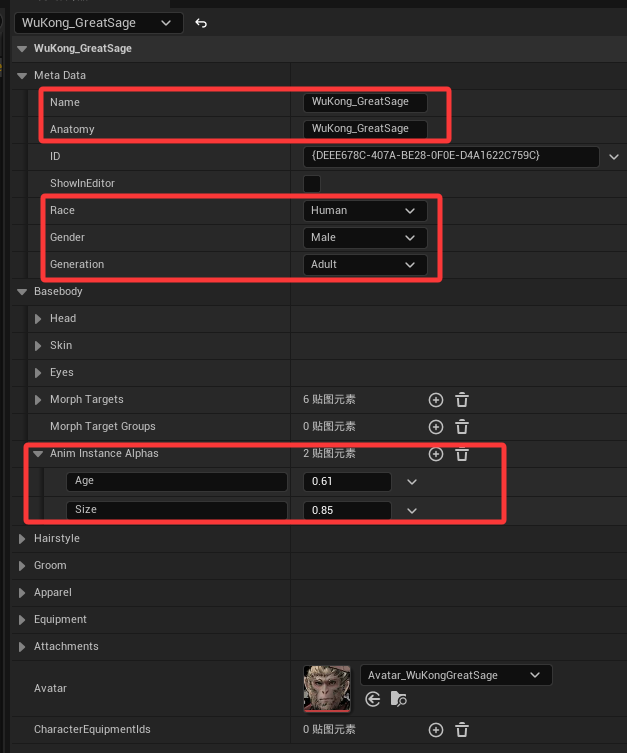

2 | Anatomy填入"DT_AnatomyProfiles_V10"配置表中的行命名

3 | Race目前仅支持Human

4 | Gender依照你角色性别选就好，Male男性，Female女性

5 | Generation目前仅支持Adult

6 | Age因为目前没有寿命的设置，所以可以填入0.1~1之间任意值即可

7 | Size这里指的身高，按照190cm=1进行换算

3 | 角色信息配置：DT_ModHumanData

1 | Customization Id，填入"DT_PresetCustomizationProfiles_V10"配置表中的行命名

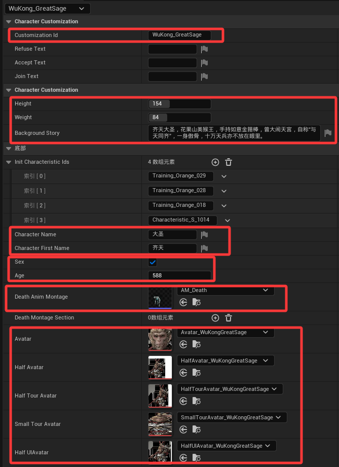

2 | Height/Weight/BackgroundStory，身高/体重/背景介绍

3 | Init Characteristic Ids，角色特性(目前暂不可用，后续提供)

4 | Character First Name/Character Name，姓和名(都需要配置，否则会使用默认名称)

5 | Sex/Age，性别/年龄

6 | Death Anim Montage，死亡动画蒙太奇

7 | …Avatar，用于各处的立绘，尺寸标准如下

Avatar：102x103

Half Avatar：630x580

Half Tour Avatar：1536x1053

Small Tour Avatar：239x860

Half UIAvatar：418x378

1 | Hit Anim Montage，受击动画（区分受击方向，需配置四个方向的受击蒙太奇）

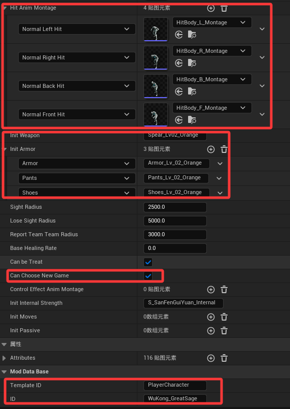

2 | Init Weapon与Armor

武器前缀：Sword/Spear/Bow/Fist

部位前缀：Armor/Pants/Shoes

品质后缀：Green/Blue/Purple/Orange/Golden

武器命名统一格式：前缀_LV0x_后缀

部位命名统一格式：前缀_LV_0x_后缀

目前x可以填入1~4范围

3 | 需要勾选"Can Choose New Game"，才能将角色在初始设为可选

4 | Template ID，勿动，一旦配置的角色有缺省的地方，将采用这个ID进行填补

5 | ID，需与行命名保持一致

6 | Attributes，属性重点说明

这三组数据需要保持一致(身体各部位数值)

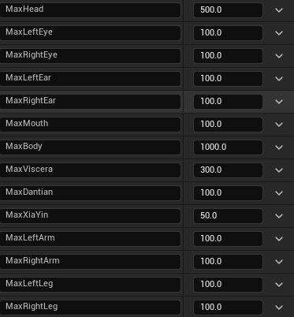

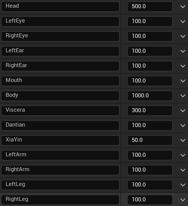

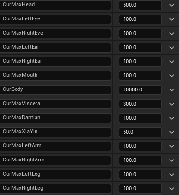

生活技能等级

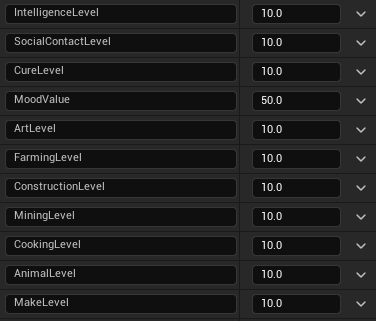

其他诸如：MoveSpeed(移速)/FreeWeight(负重)/Attack(攻击力)/Shield(罡气)等不再赘述，可自行翻译查阅调整
