# 动物or怪物配置

创建 Mod 后，将动物相关资产（骨骼、模型、贴图、材质、动画）放在 **Mod 根目录**下，即：

**`Content/Mods/<Mod文件夹名>/`**

其中 `<Mod文件夹名>` 与你在「创建 Mod」时使用的 **Mod Id / 文件夹名**一致；Mod 内容必须位于 **`Content/Mods/` 的一级子文件夹**内（勿写成 `Content/` 下与 `Mods` 平级的其它路径）。目录结构与打包校验说明见 [Mod工程与目录说明.md](./Mod工程与目录说明.md)。

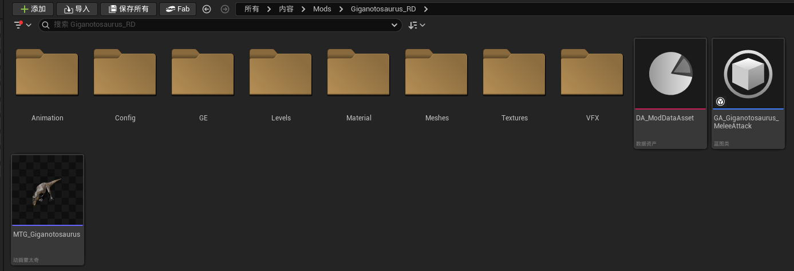

步骤一 | 在MOD文件夹里创建对应的MOD信息资产表，并将其打开

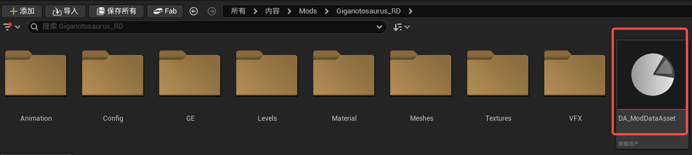

步骤二 | 创建并在DA_ModDataAsset里添加关联3张表，分别为Animal、AnimalActionAbility、GameAbility

1 | AnimalConfig：用于配置动物的基本信息

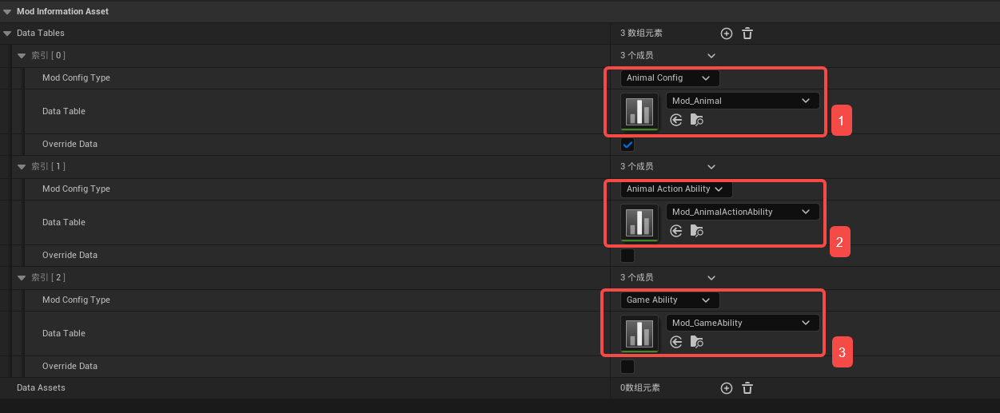

2 | AnimalActionAbility：用于配置动物日常非战斗情况下的行为，如闲逛、睡觉等

3 | GameAbility：用于配置动物的能力，即攻击和技能

创建关联配置表时需注意与ConfigType保持一致

所有创建的配置表需放到 **`Content/Mods/<Mod文件夹名>/Config/`** 目录下（下文「Mods/XXX」均指该路径）

Override：勾选后将覆盖原始数据，建议AnimalConfig选择勾选，其余2个表不勾选

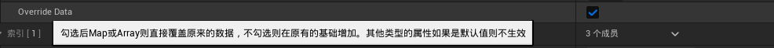

步骤三 | 配置表详解

1) | AnimalConfig动物信息配置

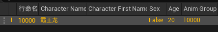

与角色相关配置表一样，行命名为后续调用的唯一ID，请务必注意

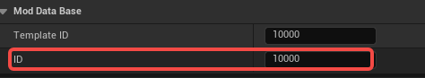

ID务必与行命名保持一致

TemplateID | 引用的原始表中的ID，当配置信息缺失时，将引用相应模版数据

图中的10000是狼王ID，建议增加动物时都先以此ID为模版

截图中ID和TemplateID都填的10000，即代表安装此MOD后霸王龙将替换狼王在地图中出现

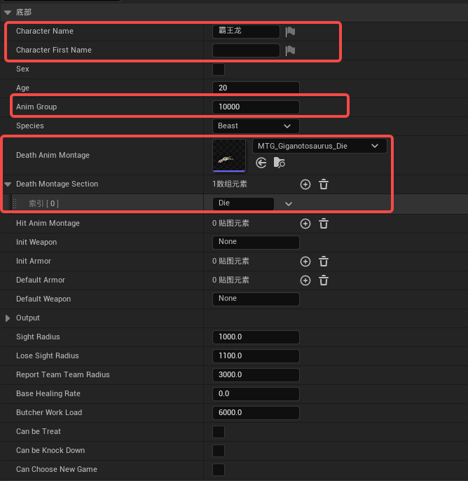

Character First Name /Character Name | 和角色配置类似，怪物详情界面显示的名字，可不配置FirstName，若配置则FirstName排列在前

Sex&Age | 性别/年龄，可根据喜好自由配置，勾选状态为雄性

AnimGroup | 非常重要，动物族群分组，AnimalActionAbility表调用

建议不同ID动物用不同的Group分组ID，ID最好从6位数开始（如100001）

Species | 物种类型，默认选Beast就好，不建议更改

DeathAnimMontage | 死亡动画蒙太奇

DeathAnimMontageSection | 调用的片段名，必须与死亡蒙太奇里一致，注意大小写

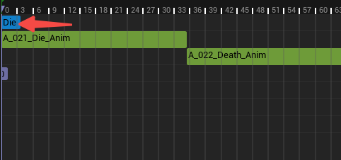

HitAnimMontage | 动物的受击蒙太奇动画，开通了配置接口，但现阶段动物都没有做受击动画，建议留空

Init/Default  Weapon/Armor | 初始或默认的武器和装备，建议留空

Output | 动物击杀后的产出，如生肉、兽皮等。

建议先套用模版，等开放原始物品ID后配置

SightRadius | 视野范围/丢失视野的范围。建议填写范围在300到1500之间

ButcherWorkLoad | 击杀动物后完成屠宰所需的工作量。可根据情况酌情填写数值

CanbeTreat | 能否被治疗。建议默认不勾选

CanbeKnockDown | 能否被击倒。因击倒相关参数暂不可调，建议不勾选

CanChooseNewGame | 能否初始被选为队友。强烈建议不勾选

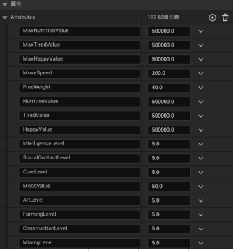

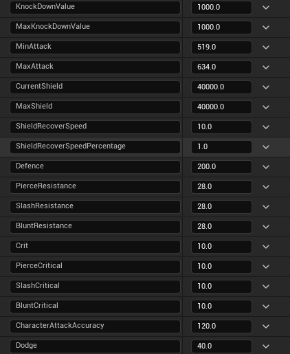

各属性配置 | 与角色属性通用，可参考配置

酌情配置动物的攻防属性、部位血量

AnimalBodyType | 动物体型类型，决定吃饭睡觉时适用的食槽和睡垫。根据动物体型选择

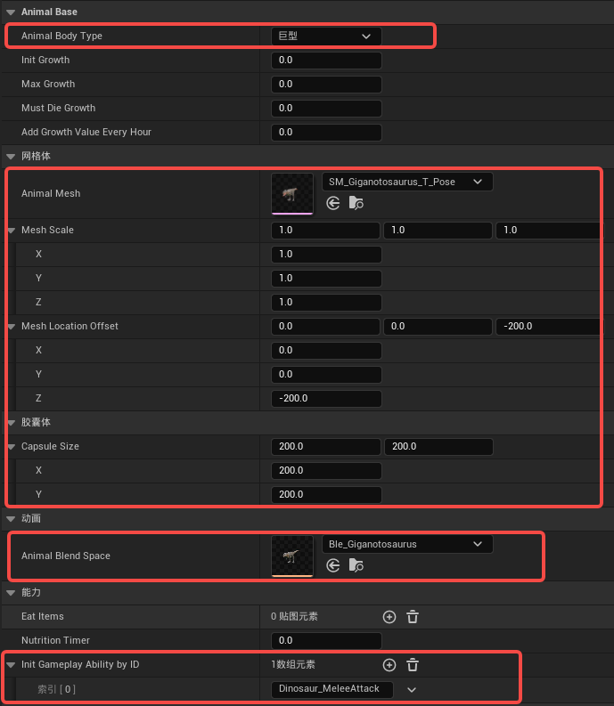

Growth相关字段 | 不用填写

AnimalMesh | 调用的骨骼网格体模型

MeshScale | 模型的大小缩放比例，分XYZ三个方向

MeshLocationOffset | 模型的相对偏移，用于调整使其贴于地面

胶囊体CapsuleSize | 模型的碰撞体大小，用于检测碰撞、伤害

模型的比例、偏移，胶囊体大小是否合适，可能需要反复在游戏中验证，较为繁琐

AnimalBlendSpace | 动物的移动混合空间，控制待机、走动、跑动时的速度

注意：创建文件时类型需为混合空间1D

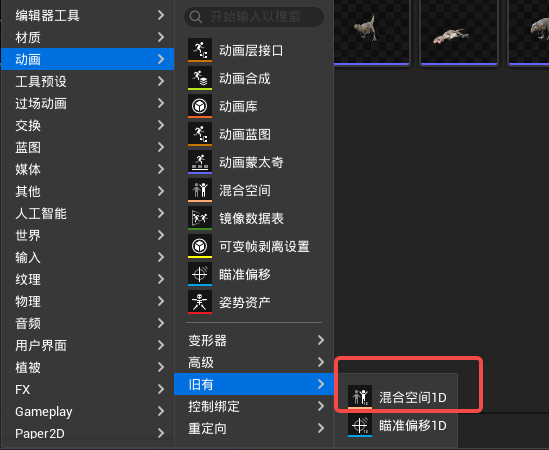

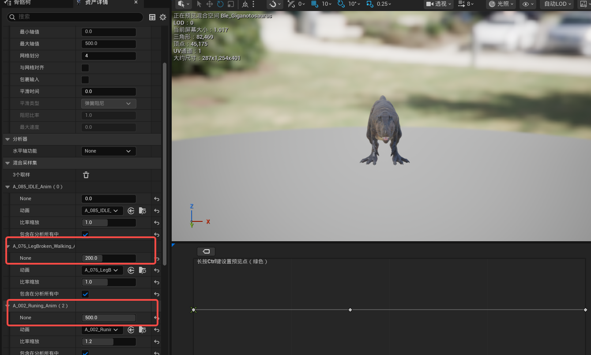

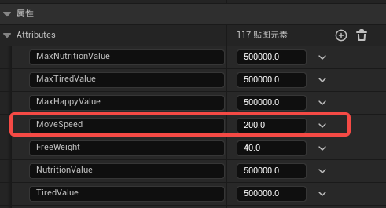

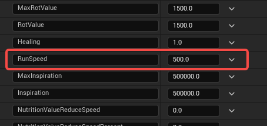

在调整混合空间文件时，注意尽量和属性配置保持一致

InitGamePlayAbilityByID | 动物的初始能力ID，也就是普攻、技能等。取自GameAbility表。

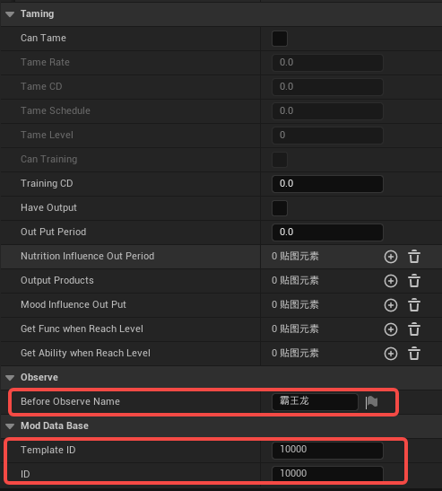

驯养相关配置Taming | 建议不要勾选，避免出现体型过大卡房子之类的问题

BeforeObserveName | 动物头顶显示的名字，可自由起名

2) | GameAbility动物技能配置

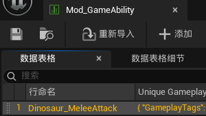

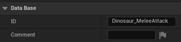

注意：依然保持行命名与ID保持一致

此处的行命名决定了动物攻击时的能力，由AnimalConfig表里的InitGamePlayAbilityByID字段调用

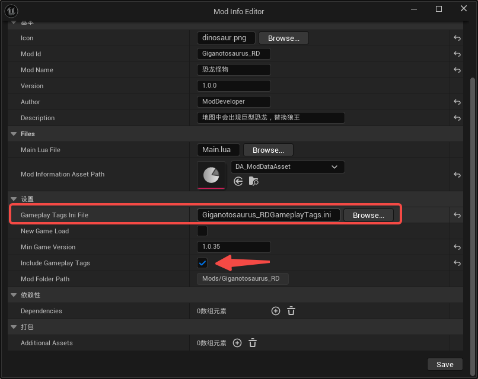

创建标签管理文件（非常重要）

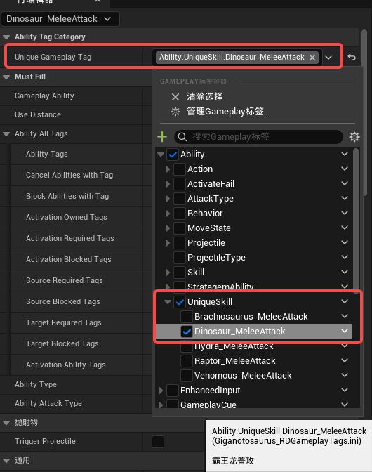

1 | 每次新增怪物时，其有独特的攻击动画模组，就需要为其建立独立的技能标签

2 | 在新建MOD或编辑MOD信息时，需要勾选IncludeGameplayTags，勾选后将在MOD文件夹路径下自动生成一个配置文件

生成后在此MOD新增标签时请选择此文件作为Source

配置文件生成后需要重启一次UE才能在工程中可用

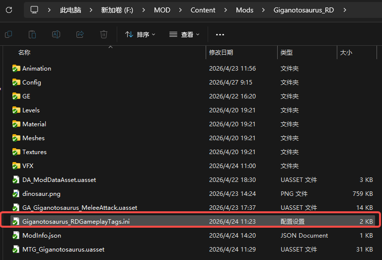

3 | 新增标签

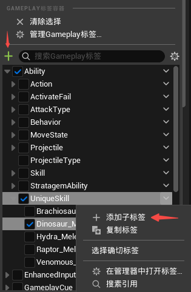

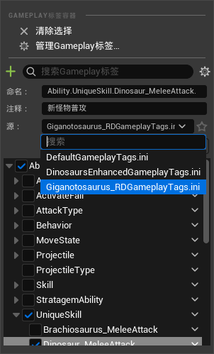

点击绿色加号或对应目录旁边箭头，添加子标签

分别为标签命名，添加注释（可选）、选择源

注意：选择的源必须是MOD目录下创建的那一个配置文件

4 | 新增怪物的技能标签，建议统一新增在Ability.UniqueSkill这个目录下

5 | 选择新增的标签作为技能独特标签

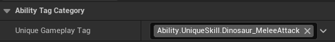

UseDistance | 决定离目标多远开始施放能力的距离

GameplayAbility | 此表的每一项都需要创建一个GA蓝图文件

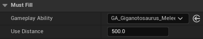

创建方法：找到目录中的父类GA文件（GA_GeneralAbilityBase），右键创建子蓝图，命名完成后，将子文件移动到MOD文件夹目录下

创建完成即可，不用在里面编辑文件

最后将刚创建的子蓝图引用到字段中

注意：切勿移动或编辑父类GA，只创建其子文件；子文件务必放进MOD目录下，否则技能不生效

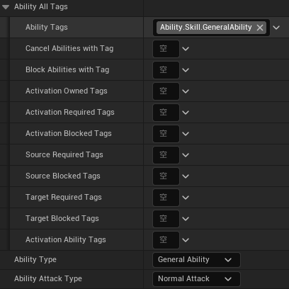

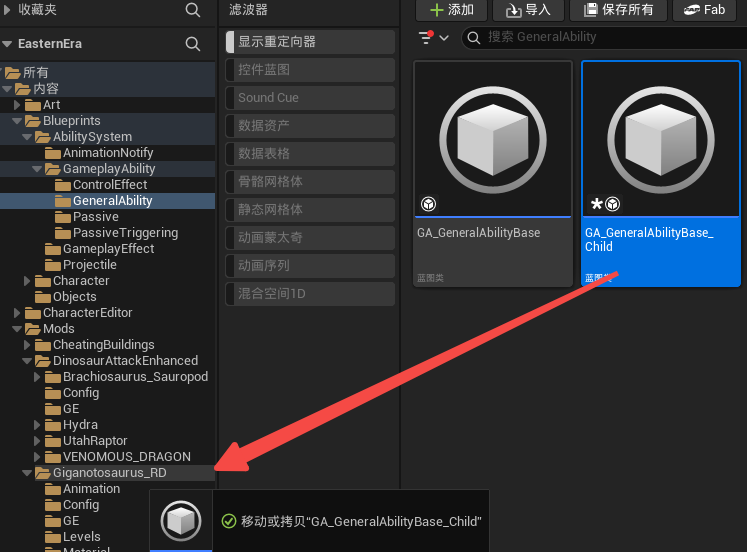

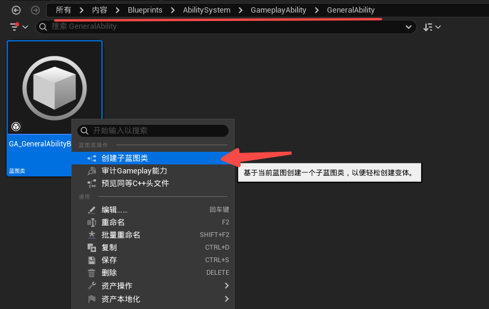

AbilityAllTags | 技能标签。涉及到较为复杂的技能情况，可以保持默认状态不管

AbilityType | 技能类型。配置怪物普攻默认选GeneralAbility（主动技能）就行。

AbilityAttackType | 攻击类型。普攻默认选NormalAttack就行

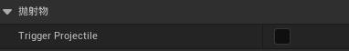

TriggerProjectile | 是否触发投射物，这里是指不通过动画通知标签，直接触发的投射物。

通常我们都通过播放动画蒙太奇触发，所以这里默认不勾选就行

技能通用信息配置 | SkillName | Icon | SkillDescribe | Quality | NeedWeaponTypes

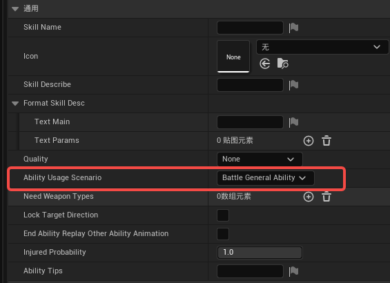

技能名称 | 图标 | 技能描述 | 品质 | 需要武器类型

这部分字段主要用于功法技能信息的配置，配置动物普攻用不到，保留默认就行

只需要注意AbilityUsageScenario类型必须为BattleGeneralAbility就行

冷却时间配置 | 勾选后，激活技能施放冷却时间

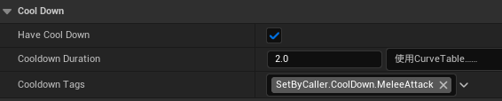

数字以秒为单位

标签统一用图上的

1 | 此普攻是否有动画蒙太奇，配置动物普攻必定勾选

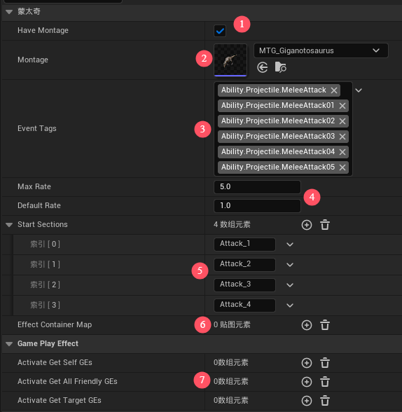

2 | 将攻击动画蒙太奇配置在此

3 | 动画蒙太奇所有片段中包含的事件标签

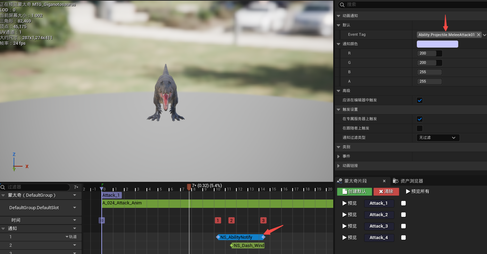

在蒙太奇片段中添加NS_AbilityNotify通知

在EventTag处添加事件标签

4 | 动画播放的最大速率和默认速率

5 | 需要用到蒙太奇动画中的片段名，用于区分不同的攻击动作

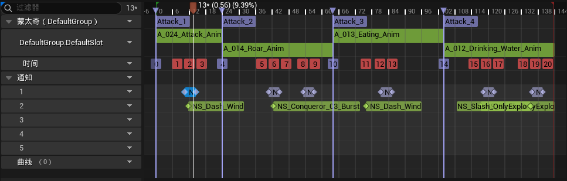

6 | 动画中触发的效果。几乎不会单独使用，不用配置

7 | 能力激活时分别给自身、友方、敌方添加的GE效果

我们配置技能效果都是通过投射物添加，所以这里不用单独配置

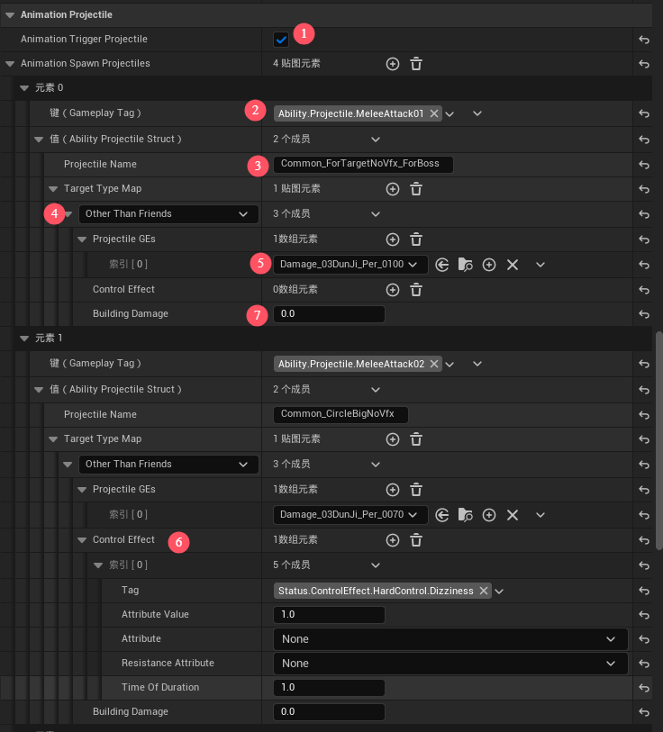

1 | 动画是否触发投射物

一般勾选，通过播放动画通知来触发投射物

2 | 投射物触发事件标签

注意:这里的标签需要与蒙太奇片段里NS_AbilityNotify通知里的一致，这样才会正确触发投射物

3 | 触发的投射物的ID

这里可以填写原始表格里的一些通用投射物ID，后续我们会提供一些常用的投射物ID

也可以自行创建一个投射物表进行单独配置

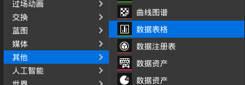

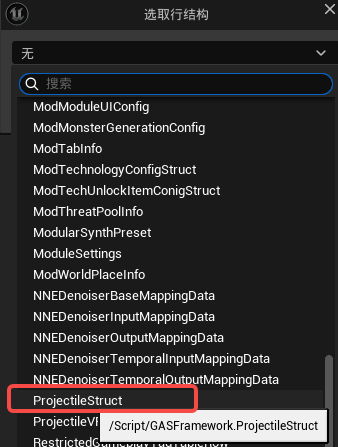

4 | 投射物施加的目标。配置攻击动画一般选择除友方外所有（Other Than Friends)

5 | 投射物造成的GE，即技能效果，一般为伤害效果

6 | 投射物造成的控制效果，需要添加对应的控制状态标签

7 | 对建筑造成的伤害，扣除建筑耐久

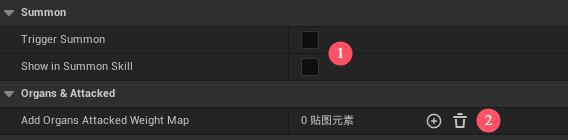

1 | 技能是否触发召唤物

暂不支持配置召唤物，默认不勾选

2 | 技能对身体部位额外的命中权重加成

默认不勾选

3) | AnimalActionAbility动物行为配置

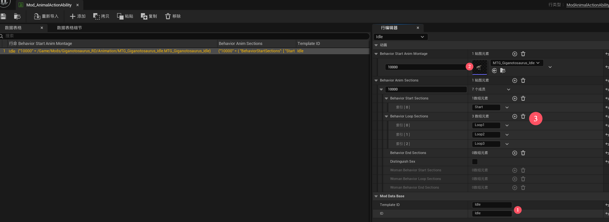

1 | 行为ID和TemplateID

以Idle（闲逛）为例，非战斗状态下动物会在地图上闲逛，所以至少要配置一个Idle的行为

原始表格中闲逛ID是Idle，所以TemplateID就是Idle，这个新增的动物也需要这个行为，所以ID和TemplateID填一样

2 | 这个行为的动画蒙太奇

左边填写这个动物的AnimGroup，前面AnimalConfig有提到，必须保持一致

右边配置对应的蒙太奇

3 | 这个行为开始、循环、结束的片段名

上面仍然填写AnimGroup，在对应字段中填写蒙太奇里的片段名

开始和结束可以没有片段，但Loop必须要有

在蒙太奇Loop片段中添加NS_AbilityNotify通知

在EventTag处添加事件标签，行为标签统一使用Montage.Behavior

4 | 行为扩展

Idle行为配置后基本就能满足动物的正常运行，后续如果需要扩展行为如睡觉、驯养、吃东西等

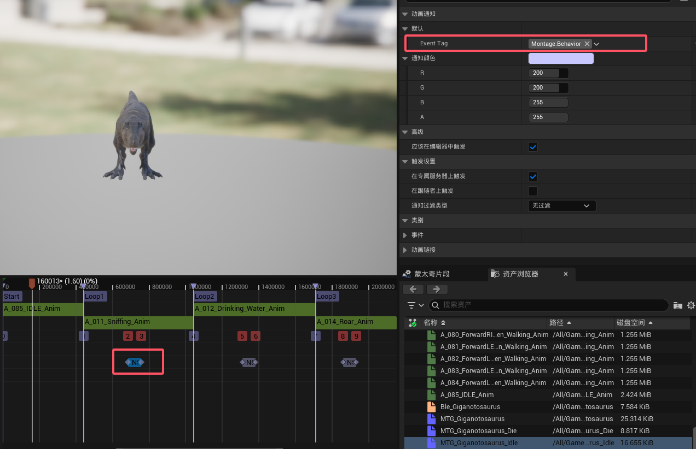

因涉及到其他更复杂的配置，这里不做赘述，后续会单独写说明讲解

建议当前只配置Idle行为就好
