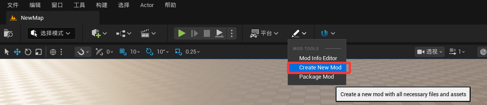
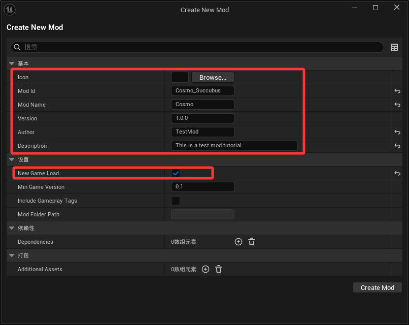
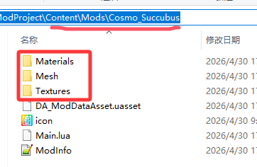

# 基础配置

步骤1 | 在引擎中新建1个Mod

步骤2 | 配置Mod基本信息(icon/ID/Name/Version/Author/Description等)

注意事项： | 1 | 创建新Mod后，会在.../Content/Mods目录下生成以"Mod Id"为命名的文件夹

2 | 如需要在新游戏使用到的配置则必须勾选“New Game Load”，否则新开游戏时将不会加载

3 | icon可以在文件夹创建后再放入到根目录配置(只能放在根目录，比如.../Content/Mods/xxx下)

步骤3 | 将角色资源拷贝到.../Content/Mods/xxx目录下(xxx是你刚才新建的Mod Id名称)

注意事项： | 1 | 检查你所有的资源路径，是否与.../Content/Mods/xxx 相符，否则会导致丢失材质、骨骼等错误

